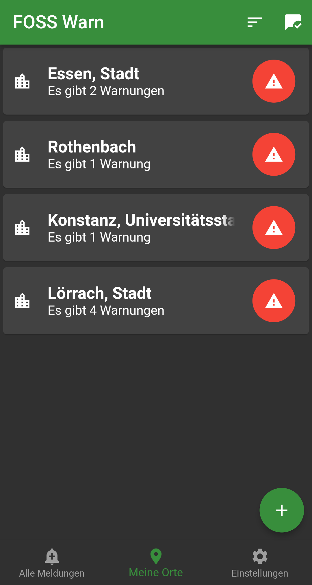
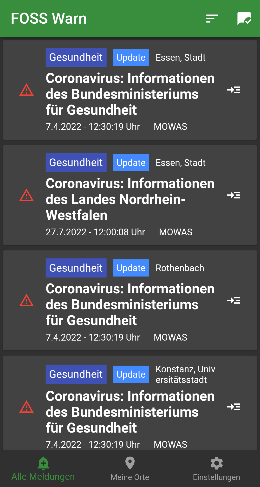
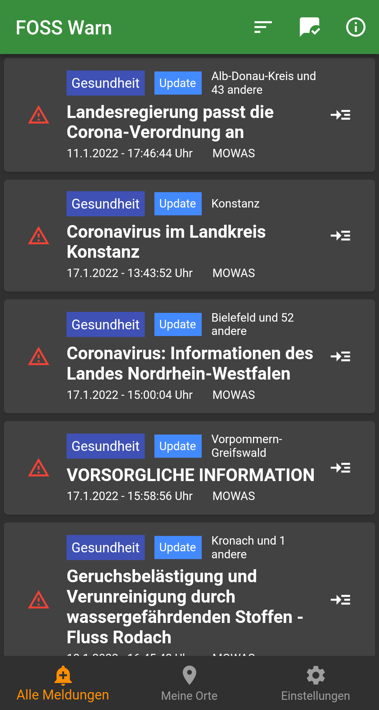
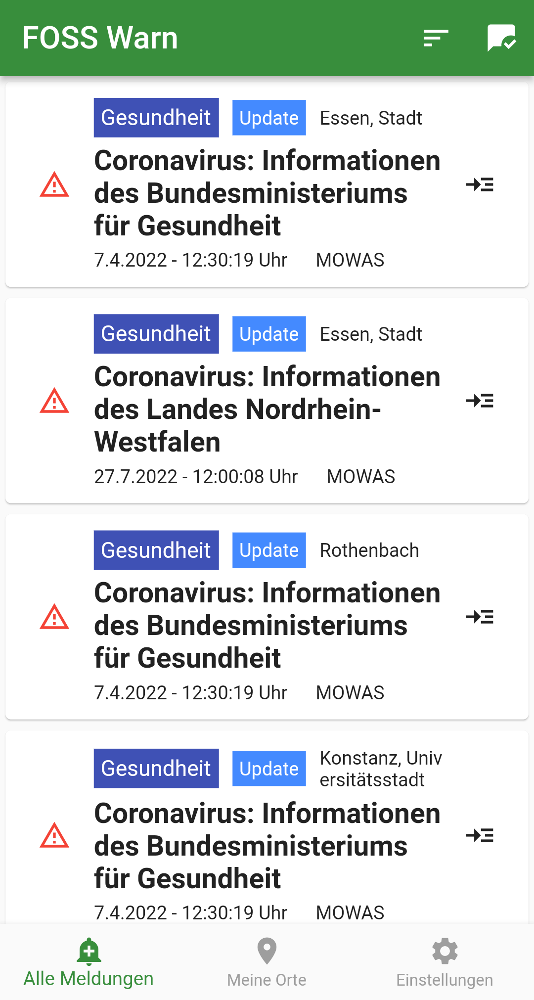
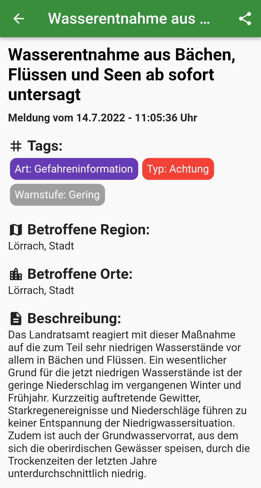

  
  <h1>FOSS Warn</h1>

Get emergency alerts from warnung.bund.de  

An unofficial open source application written in Flutter to get emergency alerts from https://warnung.bund.de/meldungen. This app has nothing to do with the official APP *Nina* from BBK. New with version 0.4.0 you can also receive emergency alerts from AlertSwiss (Alpha). Starting with version 1.0.0, FOSSWarn will use the [FOSS Public Alert Server](https://invent.kde.org/webapps/foss-public-alert-server), a shared adventure of KDE and FOSSWarn, to receive alerts from over 270 cap alert feeds worldwide.

## Funding
*2024-10 until 2025-10*

> This project was funded through the [NGI0 Core Fund](https://nlnet.nl/core), a fund established by [NLnet](https://nlnet.nl/) with financial support from the European Commission's [Next Generation Internet](https://ngi.eu/) programme, under the aegis of [DG Communications Networks, Content and Technology](https://commission.europa.eu/about-european-commission/departments-and-executive-agencies/communications-networks-content-and-technology_en) under grant agreement [No. 101092990](https://cordis.europa.eu/project/id/101092990).

 &nbsp;&nbsp; 

## Current state of development
We are currently migrating to the FPAS server. Version 0.8.0 will be the last version with direct support for the BBK API; instead, FOSSWarn will completely migrate to FPAS and UnifiedPush notifications. This will be a breaking change.

## TODO
 - see [project board](https://github.com/nucleus-ffm/foss_warn/projects?type=classic)

## FAQ

How to change the notification sound?

Go to the app settings and press „Einstellungen öffnen” -> "Warnstufe: {Warnstufe}" -> "Expand" -> "Sound". 

How do I receive notifications?

FOSS Warn does not use push services. But a background service pulls the latest warnings at a certain frequency and when there is a warning for you, you get a notification. This mechanism only works when the background service is running. When it is stopped, you will not receive any notification. With the status notification you can always see when the last update took place.

Do you have a custom F-Droid repo?

Yes, but you should prefer to download via F-Droid. Because of the extra work, the version in my repo is not the latest. You can add my custom repo to F-Droid and install the latest Github release with your F-Droid client. All info <a href="https://github.com/nucleus-ffm/Nucleus-F-Droid-Repo">here </a>.

Is FOSS Warn currently german only?

No, the UI is translated via weblate. Alerts via the NINA API are only available in German. Alerts from alertSwiss are available in several languages.

How can I receive update notification for new versions when I use the APK from Github?

In previous versions foss warn had a built-in update check. But we removed this code because it doesn't seem to be necessary for us. If you want to get a notification when we have released a new version, you should take a look at apps like <a href="https://github.com/ImranR98/Obtainium">Obtainium</a>.

## Contribute
FOSS Warn is currently a "two-man show". So if you want to help make FOSS Warn even better, I'd love to hear from you. If you are familiar with Flutter and Dart and would like to fix or implement one or more issues, please get in touch with me, either by email or via Mastodon.

### How to get started with development
- Make sure you have installed the Flutter SDK and plugins for AndroidStudio.
- Clone the FOSSWarn repository
- Inside the project, run `flutter gen-l10n` to build the translation strings.
- You are now ready to run the application.

### Translation
We are using weblate to translate FOSS Warn. Feel free to help translate the application at [weblate](https://hosted.weblate.org/projects/foss-warn/foss-warn-app/).

### Contributors
special thanks to:
- [Mats](https://github.com/MatsG23) who fixed [#36](https://github.com/nucleus-ffm/foss_warn/issues/36) and other stuff. You can see his work [here](https://github.com/nucleus-ffm/foss_warn/commits?author=MatsG23)
- Everyone who helped translate the app

## Contact
You can email me at `foss-warn {ät} posteo {point} de`. You can also follow the project on Mastodon [@foss_warn@social.tchncs.de](https://social.tchncs.de/@foss_warn) or you can join our Matrix space ([#foss_warn:tchncs.de](https://matrix.to/#/#foss_warn:tchncs.de))

## Similar inoffical projects for other platforms
* [**FediNINA (Fediverse)**](https://meta.prepedia.org/wiki/FediNINA) Project to bring NINA warnings into the Fediverse.
* [**MINA (Matrix)**](https://github.com/djmaze/nina-matrix-bot) MINA is a matrix bot that can be used to subscribe to alerts from the NINA API.
* [**Apocalypse (Sailfish OS)**](https://github.com/black-sheep-dev/harbour-apocalypse) Apocalypse is an application for showing of messages from NINA API.
* [**NINA XMPP bot**](https://github.com/jplitza/nina_xmpp) XMPP bot that sends messages from the German NINA official warning app.
* [**Nina-FOSS**](https://github.com/SailReal/nina-foss) Similar to FOSS Warn, but written with Java

## Screenshots

## Haftungsausschluss 
Diese App wurde in der Hoffnung erstellt, dass sie nützlich ist, kommt aber OHNE JEGLICHE GEWÄHRLEISTUNG. Der Entwickler kann zu keinem Zeitpunkt garantieren, dass die App fehlerfrei funktioniert und alle Warnungen jederzeit anzeigt. Die verwendeten Schnittstellen könnten sich jederzeit verändern, wodurch die App vorerst nicht mehr funktioniert. Verlassen Sie sich deshalb zu KEINEM ZEITPUNKT auf diese App. Auch werden die Warnungen immer mit einer gewissen Verzögerung im Hintergrund empfangen. Diese App benutzt keinen Push-Services, sondern lädt in einem gewissen Zeitabstand die neusten Meldungen und benachrichtigt dann, wenn nötig. Je häufiger die App im Hintergrund Daten lädt, desto mehr Akku verbraucht sie allerdings auch. Entscheiden Sie selbst, was Sie für sich brauchen. Es könnte sein, dass Sie die Akkuoptimierung für FOSS Warn deaktivieren müssen, damit diese richtig funktioniert.
