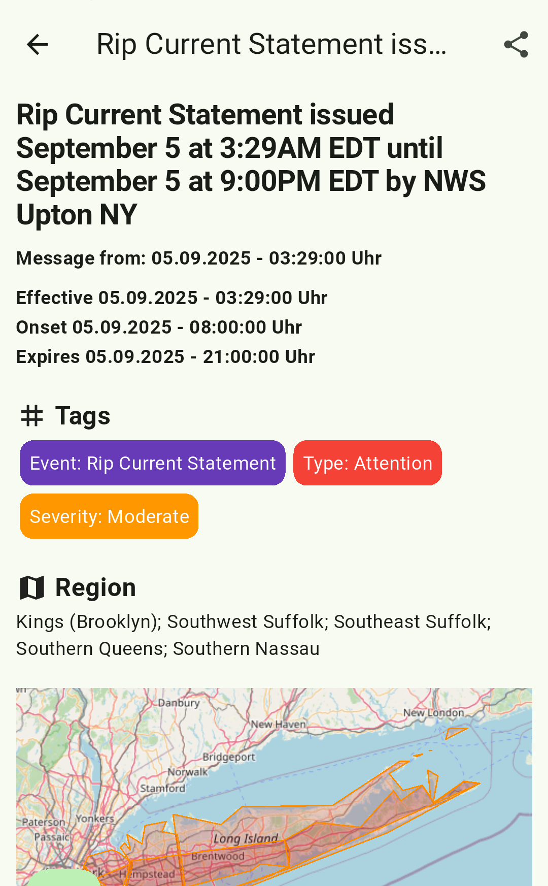
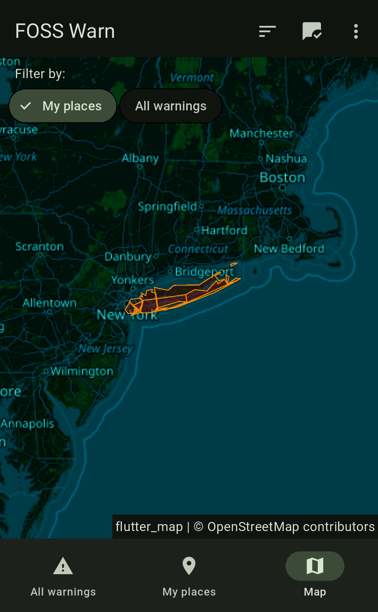

  
  <h1>FOSS Warn</h1>

Get emergency alerts from warnung.bund.de  

An open source application written in Flutter to receive emergency alerts from the [FOSS Public Alert Server](https://invent.kde.org/webapps/foss-public-alert-server)

The list of supported countries can be found here: https://alerts.kde.org/sources/status

## TODO
 - see [project board](https://github.com/nucleus-ffm/foss_warn/projects?type=classic)

## Requirements

When running the application on Linux, make sure you have the following installed:
- `xdg-user-dirs`
- A UnifiedPush provider, like KDE's KUnifiedPush

Install the DBus service (`linux/de.nucleus.foss_warn.service`) file to `/usr/share/dbus-1/services/` to be able to retrieve background notifications.
Edit the `Exec=` line where necessary.

## FAQ
See https://github.com/nucleus-ffm/foss_warn/wiki/FAQ

## Contribute
FOSS Warn is developed by a very small team. So if you want to help make FOSS Warn even better, I'd love to hear from you. If you are familiar with Flutter and Dart and would like to fix or implement one or more issues, please get in touch with me, either by email or via Mastodon. Checkout the [onboarding document](https://github.com/nucleus-ffm/foss_warn/wiki/Onboarding-document) to learn more about our work.

### How to get started with the project?
- Make sure you have installed the Flutter SDK and plugins for AndroidStudio.
- Clone the FOSSWarn repository
- Inside the project, run `flutter gen-l10n` to build the translation strings.
- You are now ready to run the application.

### Translation
We are using Weblate to translate FOSS Warn. Feel free to help translate the application at [weblate](https://hosted.weblate.org/projects/foss-warn/foss-warn-app/).

### Contributors
special thanks to:
- [Mats](https://github.com/MatsG23) who fixed [#36](https://github.com/nucleus-ffm/foss_warn/issues/36) and other stuff. You can see his work [here](https://github.com/nucleus-ffm/foss_warn/commits?author=MatsG23)
- [PureTryOut](https://github.com/PureTryOut) who helped to refactor the codebase, added Linux support and more.  You can see this work [here](https://github.com/nucleus-ffm/foss_warn/commits?author=PureTryOut)
- Everyone who helped translate the app

## Contact & Social media
- E-Mail: `foss-warn {ät} posteo {point} de`
- Matrix space: https://matrix.to/#/#foss_warn:tchncs.de
- Mastodon: [@foss_warn@social.tchncs.de](https://social.tchncs.de/@foss_warn)

## Similar inoffical projects for other platforms
* [**FediNINA (Fediverse)**](https://meta.prepedia.org/wiki/FediNINA) Project to bring NINA warnings into the Fediverse.
* [**MINA (Matrix)**](https://github.com/djmaze/nina-matrix-bot) MINA is a matrix bot that can be used to subscribe to alerts from the NINA API.
* [**Apocalypse (Sailfish OS)**](https://github.com/black-sheep-dev/harbour-apocalypse) Apocalypse is an application for showing of messages from NINA API.
* [**NINA XMPP bot**](https://github.com/jplitza/nina_xmpp) XMPP bot that sends messages from the German NINA official warning app.
* [**Nina-FOSS**](https://github.com/SailReal/nina-foss) Similar to FOSS Warn, but written with Java

## Screenshots

## Disclaimer
This app was created in the hope that it will be useful, but it comes WITHOUT ANY WARRANTY. The developer cannot guarantee at any time that the app will function without errors and display all warnings at all times. Do NOT rely on this app at ANY TIME. Always pay attention to other sources of warnings and follow the instructions of local authorities.

## Haftungsausschluss 
Diese App wurde in der Hoffnung erstellt, dass sie nützlich ist, kommt aber OHNE JEGLICHE GEWÄHRLEISTUNG. Der Entwickler kann zu keinem Zeitpunkt garantieren, dass die App fehlerfrei funktioniert und alle Warnungen jederzeit anzeigt. Verlassen Sie sich zu KEINEM ZEITPUNKT auf diese App. Beachten Sie immer andere Warnungsquellen und folgen Sie den Hinweisen der örtlichen Behörden.